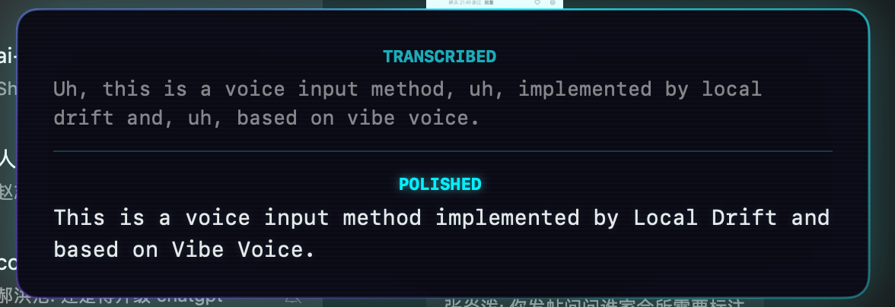
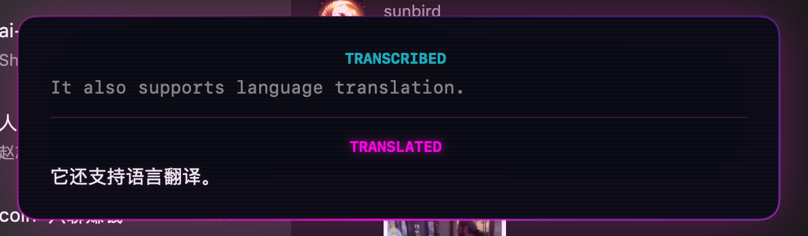
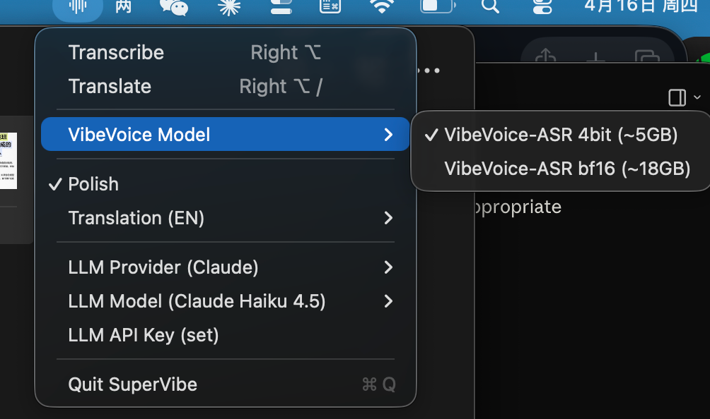
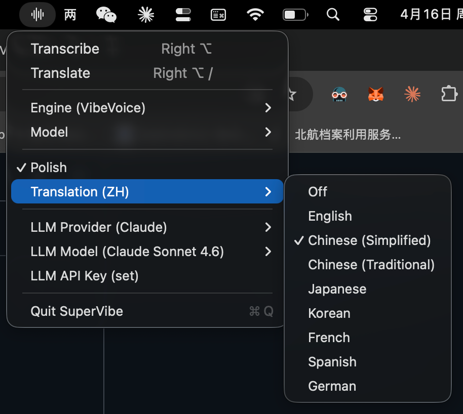

# OpenSuperVibe

OpenSuperVibe is an open-source macOS menu bar app for local voice-to-text input with optional translation. Speak naturally, and the transcribed (or translated) text is automatically pasted into the active application.

The macOS app, Swift target, and executable are currently named `SuperVibe`.

## Demo

<video src="Assets/demo.mp4" width="600" controls></video>

## Features

- **Local Voice Transcription** -- press a hotkey, speak, and the text is typed for you
- **Optional Translation** -- translate speech into English, Chinese, Japanese, Korean, French, Spanish, or German
- **Cyberpunk Overlay UI** -- floating HUD with animated waveform bars, neon color coding, and scan-line aesthetics
- **Global Hotkeys** -- works system-wide, no need to focus the app

### Transcription & Polishing

Speak naturally -- the overlay shows the raw transcription and a polished version side by side.



### Translation

Switch to translation mode and the overlay turns magenta, showing the original transcription alongside the translated text.



## Hotkeys

| Shortcut | Action |
|---|---|
| **Right Option** (press & release) | Start/stop transcription |
| **Right Option + /** | Start/stop translation (uses the language selected in the menu bar) |
| **ESC** | Cancel current session |

- Transcription mode shows **cyan** UI
- Translation mode shows **magenta** UI

## Menu Bar

Click the waveform icon in the menu bar to:

- Manually start/stop recording
- Choose between Cloud Pipeline and local VibeVoice engine
- Select a translation target language (or turn translation off)
- Quit the app

| Engine selection | Language selection |
|---|---|
|  |  |

## Requirements

- macOS 14.0+
- Apple Silicon Mac recommended for MLX/VibeVoice
- VibeVoice via `mlx-audio`
- Microphone permission
- Accessibility permission (for global hotkeys)
- Optional Anthropic or Gemini API key for polishing and translation

## Installation

Install the local speech-to-text dependency:

```bash
brew install pipx
pipx install mlx-audio
```

OpenSuperVibe looks for the `mlx-audio` Python environment at:

```text
~/.local/pipx/venvs/mlx-audio/bin/python3
```

Verify the dependency is visible:

```bash
~/.local/pipx/venvs/mlx-audio/bin/python3 -c "import mlx_audio; print('mlx-audio ok')"
```

The first transcription loads a VibeVoice model and may download model weights. The default model is `mlx-community/VibeVoice-ASR-4bit` (~5GB). The menu also offers `mlx-community/VibeVoice-ASR-bf16` (~18GB) for higher quality.

Optional polishing and translation use either Anthropic or Gemini. Choose the provider and enter your API key from the menu bar app after launch.

## Build & Run

```bash
swift build
swift run
```

Or open in Xcode:

```bash
open Package.swift
```

## Architecture

| File | Role |
|---|---|
| `AppDelegate.swift` | Menu bar UI and status item |
| `AppState.swift` | Core state machine and local transcription orchestration |
| `HotkeyManager.swift` | Global hotkey detection (Right Option, ESC) |
| `OverlayPanel.swift` | Floating cyberpunk overlay (SwiftUI + NSPanel) |
| `AudioRecorder.swift` | Microphone capture, downsampled to 16kHz mono PCM |
| `VibeVoiceSTT.swift` | Local VibeVoice process management and transcription |
| `LLMService.swift` | Optional text polishing and translation |
| `PasteService.swift` | Clipboard write + simulated Cmd+V paste |
| `Config.swift` | Session stages |

## How It Works

1. User presses the hotkey to start recording
2. Audio is captured from the microphone and kept in memory locally
3. On stop, the recording is written to a temporary WAV file
4. VibeVoice transcribes the WAV locally
5. Optional LLM post-processing polishes or translates the text
6. The final text is pasted into the frontmost application via the clipboard

## License

MIT. See `LICENSE`.
